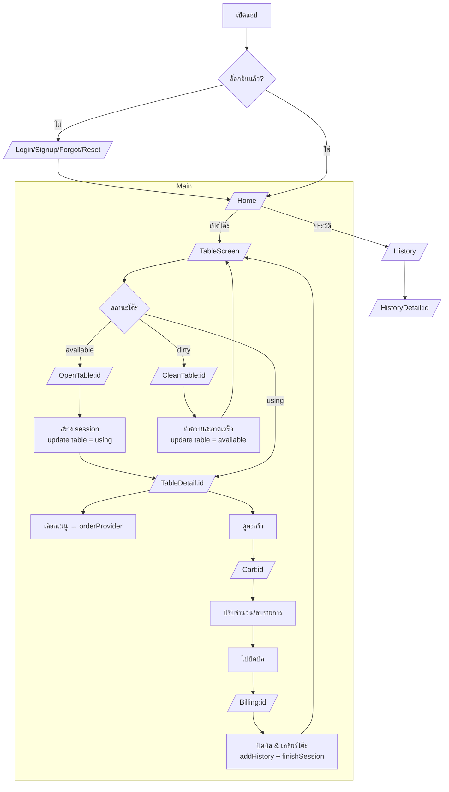

# MUTA Flowchart (Mermaid)
ภาพรวม flow หลักของแอป ตั้งแต่ Auth → เปิดโต๊ะ → ใช้งาน → ปิดบิล → ทำความสะอาด → ประวัติ

## หมายเหตุจุดสำคัญ
- `sessionTimerProvider` แสดงเวลาใช้งาน/เหลือแบบเรียลไทม์ใน TableScreen, TableDetail, Billing
- `sessionTimeProvider.finishSession` ปิดบิล: บันทึก `timeused`, set `status=finished`, เปลี่ยนโต๊ะเป็น `dirty`
- `historyAddProvider` บันทึกประวัติบิลเพื่อดูใน History/HistoryDetail
