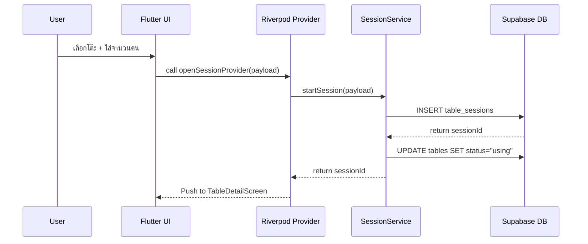
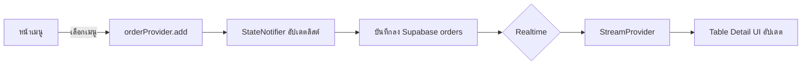
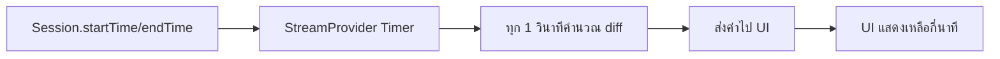
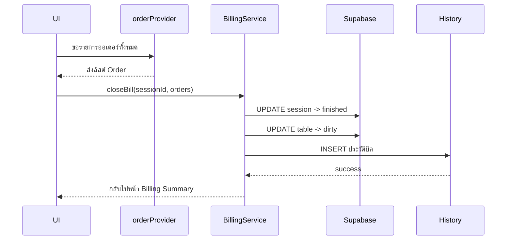
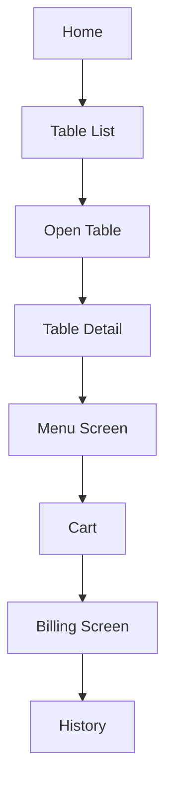

# 📄 **README.md – MUTA (หมูกะทะ Management App)**  
ระบบจัดการร้านหมูกะทะแบบ Real-Time ด้วย Supabase + Flutter + Riverpod + GoRouter + Freezed + Logger

---

# 🐷🔥 **ภาพรวมโปรเจกต์**

MUTA เป็นแอปที่ใช้จัดการร้านหมูกะทะแบบเรียลไทม์  
รองรับการเปิดโต๊ะ → ออเดอร์ → นับเวลา → ปิดบิล → เก็บประวัติ  
ไม่มีระบบ Login พนักงานใช้งานได้ทันที

ใช้เทคโนโลยีหลัก:
- **Flutter**
- **Riverpod**
- **Freezed**
- **Supabase (REST + Realtime)**
- **GoRouter**
- **Logger**

---

# 🗂️ โครงสร้างโปรเจกต์ (Folder Structure)

```text
lib/src/
 ├── apis/
 ├── config/
 ├── constants/
 ├── database/
 ├── extensions/
 ├── models/
 ├── providers/
 ├── routes/
 ├── screens/
 ├── services/
 ├── theme/
 ├── utils/
 └── widgets/
```

---

# 🧩 Data Flow Diagram (Mermaid)

## 🧭 การเปิดโต๊ะ (Open Table Flow)



---

## 🍽️ Flow การสั่งอาหารเข้าโต๊ะ



---

## 🕒 นับเวลาถอยหลัง 90 นาที



---

## 💵 ปิดบิล (Billing Flow)



---

# 📌 ตารางฐานข้อมูลที่ใช้ (Supabase Schema)

### 1) tables – รายการโต๊ะ  
### 2) table_sessions – การเปิดโต๊ะ  
### 3) menu_items – เมนู  
### 4) orders – รายการอาหาร  
### 5) history – บิลที่ปิดแล้ว  

รองรับ Realtime ทุกตาราง  
เปิด RLS + policy allow all (เพราะไม่มี Auth)

---

# 🧱 Freezed Model ตัวอย่าง

```dart
@freezed
class MenuItem with _$MenuItem {
  const factory MenuItem({
    required int id,
    required String name,
    required double price,
    required String category,
    String? imageUrl,
  }) = _MenuItem;

  factory MenuItem.fromJson(Map<String, dynamic> json) =>
      _$MenuItemFromJson(json);
}
```

---

# 🧠 Riverpod ตัวอย่างที่ใช้บ่อย

## โหลดเมนูจาก Supabase  
```dart
final menuProvider = FutureProvider((ref) async {
  final supabase = ref.watch(supabaseProvider);
  final data = await supabase.from('menu_items').select();
  return data.map(MenuItem.fromJson).toList();
});
```

---

## Stream ออเดอร์แบบเรียลไทม์
```dart
final orderStreamProvider =
    StreamProvider.family<List<OrderItem>, int>((ref, sessionId) {
  final client = ref.watch(supabaseProvider);
  return client
      .from('orders')
      .stream(primaryKey: ['id'])
      .eq('session_id', sessionId)
      .map((rows) => rows.map(OrderItem.fromJson).toList());
});
```

---

## StateNotifier สำหรับ Cart / Order

```dart
class OrderNotifier extends StateNotifier<List<OrderItem>> {
  OrderNotifier() : super([]);

  void add(MenuItem item) {
    final current = [...state];
    current.add(OrderItem(menuId: item.id, quantity: 1, price: item.price));
    state = current;
  }

  void clear() => state = [];
}

final orderProvider =
    StateNotifierProvider<OrderNotifier, List<OrderItem>>((ref) {
  return OrderNotifier();
});
```

---

# 🧭 GoRouter Setup

```dart
final router = GoRouter(
  routes: [
    GoRoute(path: '/', builder: (_, __) => const HomeScreen()),
    GoRoute(
      path: '/table/:id',
      builder: (context, state) {
        final id = int.parse(state.pathParameters['id']!);
        return TableDetailScreen(id: id);
      },
    ),
  ],
);
```

---

# 🪵 Logger

```dart
final logger = Logger(
  printer: PrettyPrinter(methodCount: 1),
);

logger.i("เปิดโต๊ะสำเร็จ");
logger.e("เกิดข้อผิดพลาด", error: e);
```

---

# 🧩 UX Flow ของแอป



---

# 🧪 ฟีเจอร์หลักที่ Dev จะใช้งานบ่อย

- โหลดข้อมูล FutureProvider  
- ฟังRealtime StreamProvider  
- เขียน business logic ผ่าน Service  
- ใช้ Freezed model + json  
- แยก UI ออกจาก logic ให้หมด  
- Routing แบบ clean ด้วย GoRouter family  
- Logger สำหรับ debug flow เปิดโต๊ะ / ปิดบิล  
- ทำ State แยกด้วย StateNotifier  

---

# 🏁 วิธีเริ่มต้นโปรเจกต์ให้ถูกต้อง

1. ตั้งค่า Supabase + import SQL  
2. ตั้งโครงสร้างโฟลเดอร์ตามที่กำหนด  
3. สร้าง model ทั้งหมดด้วย Freezed  
4. สร้าง provider (future, stream, state notifier)  
5. สร้าง service แยก logic ออกจาก UI  
6. ทำ router  
7. ทำ UI ทีละหน้า เริ่มจาก Home → Table → Session → Menu → Billing  
8. ใส่ Logger แสดง event สำคัญ เช่น  
   - เปิดโต๊ะ  
   - เพิ่มออเดอร์  
   - ปิดบิล  
